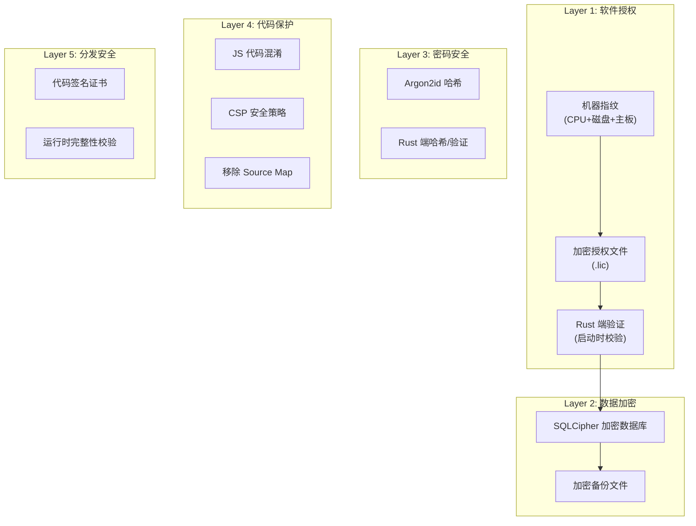
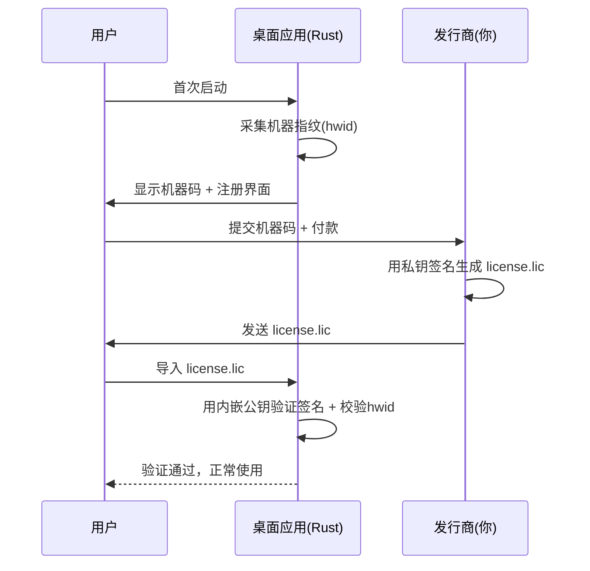

# 绣花厂订单管理系统 — 商业保护方案

## 现状分析

当前安全状态存在以下问题：

- **启动密码明文存储**：密码以纯文本保存在 SQLite `appConfig` 表中，前端直接做字符串比较（`[Settings.tsx](src/pages/Settings.tsx)` 第 154 行, `[PasswordDialog.tsx](src/components/shared/PasswordDialog.tsx)` 第 31 行）
- **数据库无加密**：`xiuhua.db` 是普通 SQLite 文件，可被任意工具直接打开读取全部客户、订单、财务数据
- **备份文件无保护**：备份是原始 `.db` 文件的直接拷贝（`[lib.rs](src-tauri/src/lib.rs)` 第 15 行）
- **无软件授权机制**：任何人拿到安装包即可无限制使用
- **CSP 未配置**：`[tauri.conf.json](src-tauri/tauri.conf.json)` 中 `"csp": null`
- **安装包未签名**：无代码签名证书配置

## 保护架构总览




---

## Layer 1: 离线授权系统（核心）

**目标**：绑定机器硬件，防止安装包被随意拷贝使用。

**方案**：非对称密钥 + 机器指纹 + 离线许可证文件

### 工作流程




### 实现要点

**Rust 端**（`[src-tauri/src/lib.rs](src-tauri/src/lib.rs)`）新增模块：

- **机器指纹**：收集 CPU ID、磁盘序列号、主板序列号，做 SHA-256 哈希得到 `hardware_id`。使用 `sysinfo` + `wmi` crate（Windows 平台）
- **许可证结构**：JSON 格式包含 `hardware_id`、`product`、`edition`（版本/功能等级）、`expires_at`（可选过期时间）、`signature`（Ed25519 签名）
- **验证逻辑**：应用启动时在 Rust 端用内嵌的 Ed25519 公钥验证签名，校验 `hardware_id` 是否匹配当前机器
- **发行商工具**：单独的命令行工具，用私钥为指定机器码生成许可证文件

**新增 Rust 依赖**：

- `ed25519-dalek` — Ed25519 签名/验证
- `sysinfo` — 跨平台硬件信息
- `sha2` — SHA-256 哈希
- `base64` — 编码
- `chrono` — 时间处理（过期判断）

**前端变更**：

- `[App.tsx](src/App.tsx)` 启动流程增加授权校验步骤（在密码验证之前）
- 新增 `LicenseGate` 组件：未授权时显示机器码 + 许可证导入界面
- `[Settings.tsx](src/pages/Settings.tsx)` 增加"授权信息"卡片，显示授权状态、到期时间

---

## Layer 2: 数据库加密（SQLCipher）

**目标**：数据库文件即使被拷贝也无法读取。

**方案**：将 `tauri-plugin-sql` 的 SQLite 替换为 SQLCipher。

### 实现要点

- **Cargo.toml** 修改：`tauri-plugin-sql` 启用 `sqlcipher` feature 替代 `sqlite`

```toml
tauri-plugin-sql = { version = "2", features = ["sqlcipher"] }
```

- **数据库连接 URL** 追加密钥参数：密钥从授权信息派生（或使用固定的应用级密钥 + 机器指纹混合），前端 `[db.ts](src/lib/db.ts)` 中 `DB_URL` 改为带 `pragma_key` 的连接串
- **数据迁移**：首次升级时需将现有明文 `xiuhua.db` 迁移为加密格式（Rust 端执行 `sqlcipher_export` 命令）
- **备份文件**：`[lib.rs](src-tauri/src/lib.rs)` 中的 `backup_database` 命令改为先用 SQLCipher 导出加密副本，而非简单文件拷贝

---

## Layer 3: 密码安全加固

**目标**：启动密码不可被逆向还原。

**方案**：密码哈希从前端移至 Rust 端，使用 Argon2id。

### 实现要点

- **新增 Rust 依赖**：`argon2` crate
- **新增 Tauri 命令**：
  - `hash_password(password: String) -> String` — 返回 Argon2id 哈希
  - `verify_password(password: String, hash: String) -> bool` — 验证
- **前端变更**：
  - `[Settings.tsx](src/pages/Settings.tsx)` 第 147-167 行：设置密码时调用 `invoke('hash_password', { password })` 后再存入 `appConfig`
  - `[PasswordDialog.tsx](src/components/shared/PasswordDialog.tsx)` 第 28-37 行：验证时调用 `invoke('verify_password', { password, hash })` 替代前端字符串比较
  - `[App.tsx](src/App.tsx)` 第 28-32 行：存储的是哈希值而非明文，传给 `PasswordDialog` 后由 Rust 端验证

---

## Layer 4: 前端代码保护

**目标**：增加逆向工程难度，防止直接阅读业务逻辑。

### 4a. JavaScript 混淆

- **Vite 生产构建配置**（`[vite.config.ts](vite.config.ts)`）：启用 terser 压缩 + 高级混淆

```typescript
build: {
  minify: 'terser',
  terserOptions: {
    compress: { drop_console: true, drop_debugger: true },
    mangle: { toplevel: true },
  },
  sourcemap: false,
}
```

### 4b. Content Security Policy

- `[tauri.conf.json](src-tauri/tauri.conf.json)` 配置严格 CSP，禁止加载外部脚本和内联脚本：

```json
"csp": "default-src 'self'; script-src 'self'; style-src 'self' 'unsafe-inline'; img-src 'self' asset: https://asset.localhost"
```

### 4c. 禁用开发者工具

- 生产构建中通过 Tauri 配置禁用 WebView DevTools，防止运行时调试

---

## Layer 5: 安装包签名与完整性

**目标**：防止安装包被篡改，增强 Windows SmartScreen 信任度。

### 实现要点

- 购买 Windows 代码签名证书（EV 证书可直接通过 SmartScreen）
- 在 `[tauri.conf.json](src-tauri/tauri.conf.json)` 的 `bundle` 中配置签名：

```json
"windows": {
  "certificateThumbprint": "YOUR_CERT_THUMBPRINT",
  "timestampUrl": "http://timestamp.digicert.com"
}
```

- CI/CD 构建流程中集成签名步骤

---

## 实施优先级与工作量估算


| 优先级 | 模块            | 预计工作量   | 影响范围                             |
| --- | ------------- | ------- | -------------------------------- |
| P0  | Layer 1 授权系统  | 2-3 天   | Rust 新模块 + 前端新组件 + 发行工具          |
| P0  | Layer 3 密码哈希  | 0.5 天   | Rust 新命令 + 前端 3 个文件              |
| P1  | Layer 2 数据库加密 | 1-2 天   | Cargo 依赖 + db.ts + 迁移脚本 + 备份逻辑   |
| P1  | Layer 4 代码保护  | 0.5 天   | vite.config.ts + tauri.conf.json |
| P2  | Layer 5 安装包签名 | 取决于证书采购 | tauri.conf.json + CI 配置          |


**建议实施顺序**：Layer 3 (最简单的安全修复) -> Layer 4 (配置变更) -> Layer 1 (核心授权) -> Layer 2 (数据加密) -> Layer 5 (签名)