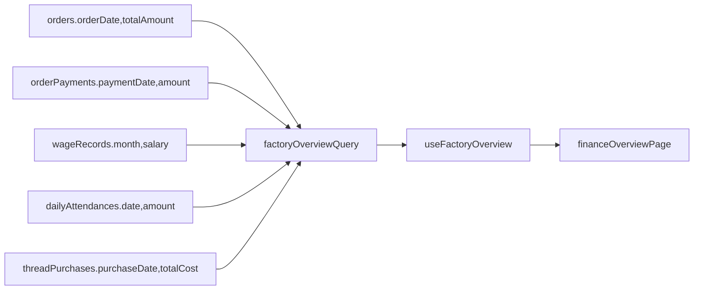

# 工厂级收支周期统计方案

## 目标

在现有“收款对账”能力之外，新增一个工厂级统计视图，支持按月、按季度、按年查看：

- 营收：按订单日期统计的订单金额
- 实收：按收款日期统计的收款金额
- 支出：工人工资 + 临时工出勤 + 线材采购
- 结果指标：总营收、总实收、总支出、净现金结余（实收 - 支出）

## 现状判断

现有能力分散在多个模块中，但还没有统一汇总：

- 收款查询已经存在于 [D:\ai\xiuhua\src\lib\queries\payments.ts](D:\ai\xiuhua\src\lib\queries\payments.ts)，并按 `paymentDate` 过滤。
- 工资与临时工支出查询存在于 [D:\ai\xiuhua\src\lib\queries\workers.ts](D:\ai\xiuhua\src\lib\queries\workers.ts)，其中 `getWageMonthlySummary` 只支持单月、且尚未形成统一报表入口。
- 线材采购记录存在于 [D:\ai\xiuhua\src\lib\queries\threads.ts](D:\ai\xiuhua\src\lib\queries\threads.ts)，但目前只有按线材查看采购历史，没有工厂维度汇总。
- 路由和导航目前只有 [D:\ai\xiuhua\src\App.tsx](D:\ai\xiuhua\src\App.tsx) 的 `/finance` 和 `/finance/statement`，以及 [D:\ai\xiuhua\src\components\layout\Sidebar.tsx](D:\ai\xiuhua\src\components\layout\Sidebar.tsx) 的“收款对账”入口，没有经营统计页。

## 设计方案

### 入口与页面归属

将新功能放在财务模块下，新增一个财务子页，例如 `/finance/overview`。这样可以复用现有财务语义和页面结构，同时避免把“客户对账”和“工厂经营统计”混在同一页面里。

### 数据口径

按时间周期生成统一统计对象：

- 营收：`orders.totalAmount`，时间字段使用 `orderDate`
- 实收：`orderPayments.amount`，时间字段使用 `paymentDate`
- 长工支出：`wageRecords.salary`，按 `month` 归入对应月份；季度/年度由月份聚合
- 临时工支出：`dailyAttendances.amount`，时间字段使用 `date`
- 线材采购支出：`threadPurchases.totalCost`，时间字段使用 `purchaseDate`

首版不新增数据库表，也不处理房租/水电等杂费；页面上明确标注“当前支出口径仅含工资和线材采购”。

### 周期能力

支持三种统计粒度：

- 月：按 `YYYY-MM`
- 季：按 `YYYY-Q1~Q4`
- 年：按 `YYYY`

建议查询层输出统一结构：

- 周期标识
- 营收
- 实收
- 工资支出
- 线材采购支出
- 总支出
- 净现金结余

这样前端可以同时支持：

- 单个周期卡片总览
- 周期列表/表格对比
- 后续扩展导出

## 实施拆分

### 1. 查询与类型层

在 [D:\ai\xiuhua\src\lib\queries(D:\ai\xiuhua\src\lib\queries 新增工厂统计查询模块，或在财务查询中增加聚合入口。

建议新增：

- 工厂经营统计类型定义到 [D:\ai\xiuhua\src\types\index.ts](D:\ai\xiuhua\src\types\index.ts)
- 一个统一查询函数，负责按周期聚合各来源数据，再合并成前端可直接消费的结构

优先复用现有 SQL 思路，而不是把大量聚合计算放到页面组件里。

### 2. Hook 层

在 [D:\ai\xiuhua\src\hooks(D:\ai\xiuhua\src\hooks 新增专用 hook，例如 `useFactoryOverview`：

- 接收粒度（月/季/年）与年份/月份参数
- 调用统一聚合查询
- 输出 loading、error、summary、rows、reload

这样能保持和 `usePayments`、`useStatement` 一致的调用风格。

### 3. 页面与路由

新增财务统计页面到 [D:\ai\xiuhua\src\pages\finance(D:\ai\xiuhua\src\pages\finance：

- 顶部提供周期粒度切换：月 / 季 / 年
- 提供年份选择；月视图额外提供月份选择
- 展示汇总卡片：营收、实收、工资支出、线材采购、总支出、净现金结余
- 展示周期明细表：便于对比每月/每季/每年的趋势
- 页面上标注统计口径说明

并同步更新：

- [D:\ai\xiuhua\src\App.tsx](D:\ai\xiuhua\src\App.tsx) 新增路由
- [D:\ai\xiuhua\src\components\layout\Sidebar.tsx](D:\ai\xiuhua\src\components\layout\Sidebar.tsx) 或财务页内增加导航入口

## 范围控制

首版建议只做以下内容：

- 月 / 季 / 年统计切换
- 工厂级汇总卡片 + 周期表格
- 营收 / 实收 / 工资 / 线材采购 / 总支出 / 净现金结余

暂不做：

- 新的“其他支出”录入表与维护页面
- 图表化趋势分析
- Excel 导出
- 首页 Dashboard 汇总卡片

这些可以在首版完成后追加，不影响当前方案落地。

## 验证建议

重点验证以下场景：

- 同一年内月、季、年数据汇总是否一致
- 一个订单跨月收款时，营收与实收是否按各自日期正确落入不同周期
- 长工工资月汇总与季度/年度累计是否一致
- 临时工出勤和线材采购在边界日期是否正确归档
- 无数据周期是否显示为 0 而不是空白

## 预期改动文件

高概率会涉及：

- [D:\ai\xiuhua\src\types\index.ts](D:\ai\xiuhua\src\types\index.ts)
- [D:\ai\xiuhua\src\lib\queries\payments.ts](D:\ai\xiuhua\src\lib\queries\payments.ts) 或新增同目录统计查询文件
- [D:\ai\xiuhua\src\lib\queries\workers.ts](D:\ai\xiuhua\src\lib\queries\workers.ts)
- [D:\ai\xiuhua\src\lib\queries\threads.ts](D:\ai\xiuhua\src\lib\queries\threads.ts)
- [D:\ai\xiuhua\src\hooks(D:\ai\xiuhua\src\hooks 下新增统计 hook
- [D:\ai\xiuhua\src\pages\finance(D:\ai\xiuhua\src\pages\finance 下新增统计页面
- [D:\ai\xiuhua\src\App.tsx](D:\ai\xiuhua\src\App.tsx)
- [D:\ai\xiuhua\src\components\layout\Sidebar.tsx](D:\ai\xiuhua\src\components\layout\Sidebar.tsx)

## 简化数据流

