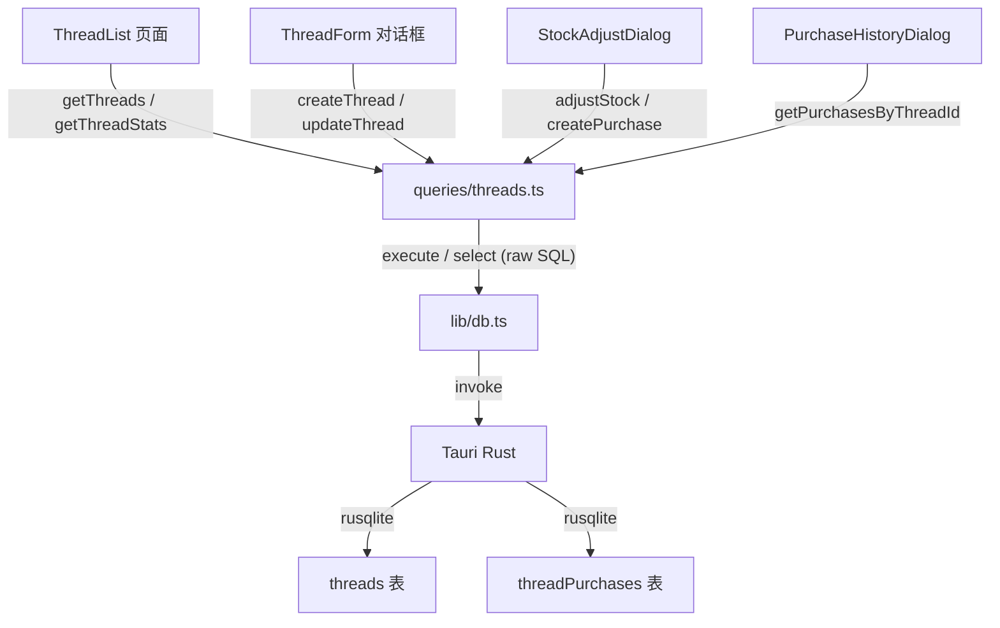

# 线材库存模块设计

## 一、数据库设计

新增两张表，通过迁移文件 `002_threads.sql` 创建。

### 1.1 threads（线材）表

记录每种线的基本信息和当前库存。

- `id` INTEGER PRIMARY KEY AUTOINCREMENT
- `colorNo` TEXT NOT NULL -- 色号（如 "8000"、"1147"）
- `brand` TEXT -- 品牌（如 Madeira、Isacord、兄弟等）
- `colorName` TEXT -- 颜色名称（如 "大红"、"深蓝"）
- `material` TEXT -- 材质（涤纶线/人造丝线/金银线/其他）
- `quantity` INTEGER NOT NULL DEFAULT 0 -- 当前库存数量（单位：筒）
- `minStock` INTEGER NOT NULL DEFAULT 0 -- 最低库存预警值
- `unitCost` INTEGER -- 最近单价（分），可选
- `supplier` TEXT -- 常用供应商，可选
- `notes` TEXT -- 备注
- `createdAt` TEXT NOT NULL DEFAULT (datetime('now','localtime'))
- `updatedAt` TEXT NOT NULL DEFAULT (datetime('now','localtime'))

**唯一约束：** `colorNo` + `brand` 组合唯一（同品牌不会有重复色号）。

### 1.2 threadPurchases（线材采购记录）表

记录每次线材采购的详情，解决"色号8000的线以前什么时候买过"的查询需求。

- `id` INTEGER PRIMARY KEY AUTOINCREMENT
- `threadId` INTEGER NOT NULL REFERENCES threads(id) -- 关联线材
- `quantity` INTEGER NOT NULL -- 采购数量（筒）
- `unitCost` INTEGER -- 单价（分），可选
- `totalCost` INTEGER -- 总价（分），可选
- `supplier` TEXT -- 本次供应商（可能与线材默认供应商不同）
- `purchaseDate` TEXT NOT NULL -- 采购日期
- `notes` TEXT -- 备注（如发票号、批次号等）
- `createdAt` TEXT NOT NULL DEFAULT (datetime('now','localtime'))

### 1.3 完整 SQL

```sql
-- 线材表
CREATE TABLE IF NOT EXISTS threads (
  id INTEGER PRIMARY KEY AUTOINCREMENT,
  colorNo TEXT NOT NULL,
  brand TEXT,
  colorName TEXT,
  material TEXT,
  quantity INTEGER NOT NULL DEFAULT 0,
  minStock INTEGER NOT NULL DEFAULT 0,
  unitCost INTEGER,
  supplier TEXT,
  notes TEXT,
  createdAt TEXT NOT NULL DEFAULT (datetime('now','localtime')),
  updatedAt TEXT NOT NULL DEFAULT (datetime('now','localtime')),
  UNIQUE(colorNo, brand)
);

-- 线材采购记录表
CREATE TABLE IF NOT EXISTS threadPurchases (
  id INTEGER PRIMARY KEY AUTOINCREMENT,
  threadId INTEGER NOT NULL REFERENCES threads(id),
  quantity INTEGER NOT NULL,
  unitCost INTEGER,
  totalCost INTEGER,
  supplier TEXT,
  purchaseDate TEXT NOT NULL,
  notes TEXT,
  createdAt TEXT NOT NULL DEFAULT (datetime('now','localtime'))
);
```

## 二、需要修改的文件

### 2.1 Rust 后端（迁移）

- **新建** `[src-tauri/migrations/002_threads.sql](src-tauri/migrations/002_threads.sql)` -- 上面的建表 SQL（threads + threadPurchases）
- **修改** `[src-tauri/src/database.rs](src-tauri/src/database.rs)` 的 `run_migrations` 函数，追加 `include_str!("../migrations/002_threads.sql")`

### 2.2 前端类型定义

**修改** `[src/types/index.ts](src/types/index.ts)`，新增：

- `THREAD_MATERIAL` 常量（涤纶线/人造丝线/金银线/其他）
- `Thread` 接口、`NewThread` 接口
- `ThreadPurchase` 接口、`NewThreadPurchase` 接口
- `ThreadFilters` 接口（按色号、品牌、库存状态筛选）

### 2.3 Drizzle Schema

**修改** `[src/lib/schema.ts](src/lib/schema.ts)`，新增 `threads` 和 `threadPurchases` 两张表的 Drizzle 定义。

### 2.4 查询层

**新建** `[src/lib/queries/threads.ts](src/lib/queries/threads.ts)`，提供以下函数：

线材 CRUD：

- `getThreads(filters?)` -- 获取线材列表，支持按色号/品牌/库存状态筛选
- `getThreadById(id)` -- 获取单条记录
- `createThread(data)` -- 新增线材
- `updateThread(id, data)` -- 修改线材信息
- `adjustStock(id, delta)` -- 调整库存数量（+/-）并更新 updatedAt
- `deleteThread(id)` -- 删除线材（同时删除关联采购记录）
- `getLowStockThreads()` -- 获取库存低于预警值的线材
- `getThreadStats()` -- 汇总统计（总品种数、低库存数、总库存筒数）

采购记录：

- `createPurchase(data)` -- 新增采购记录并同步增加 threads.quantity
- `getPurchasesByThreadId(threadId)` -- 获取某条线的全部采购历史（按日期倒序）
- `deletePurchase(id)` -- 删除采购记录（同步扣减库存）

### 2.5 页面组件

**新建** `[src/pages/threads/ThreadList.tsx](src/pages/threads/ThreadList.tsx)` -- 线材库存主页面

页面布局：

```
+------------------------------------------------------+
| 统计卡片区                                              |
| [总品种数: 48]  [总库存: 320筒]  [低库存预警: 5种]         |
+------------------------------------------------------+
| 工具栏: [搜索色号/名称]  [品牌筛选▼]  [库存状态▼]  [+新增] |
+------------------------------------------------------+
| 表格                                                   |
| 色号 | 品牌 | 颜色名称 | 材质 | 库存(筒) | 预警值 | 操作          |
| 1001 | Madeira | 大红 | 涤纶 | 12 ● | 5   | 调整 采购记录 编辑 删 |
| 8000 | Madeira | 黑色 | 涤纶 | 2  ▲ | 5   | 调整 采购记录 编辑 删 |
| ...                                                    |
+------------------------------------------------------+
```

关键交互：

- 库存数量列用颜色标识状态：正常（绿）、低库存（橙）、零库存（红）
- 快速调整库存：点击 +/- 按钮弹出数量输入框，直接增减
- 搜索支持色号和颜色名称模糊匹配
- 品牌筛选下拉（从已有数据动态获取品牌列表）
- 库存状态筛选：全部 / 低库存 / 零库存

**新建** `[src/pages/threads/ThreadForm.tsx](src/pages/threads/ThreadForm.tsx)` -- 新增/编辑线材对话框（Dialog 形式，非独立页面）

表单字段：

- 色号（必填）
- 品牌（可选，支持常用品牌快捷选择）
- 颜色名称（可选）
- 材质（下拉：涤纶线/人造丝线/金银线/其他）
- 库存数量（仅新增时填写，编辑时通过调整操作修改）
- 最低库存预警值
- 单价（可选）
- 供应商（可选）
- 备注

**新建** `[src/pages/threads/StockAdjustDialog.tsx](src/pages/threads/StockAdjustDialog.tsx)` -- 库存快速调整弹窗

- 显示当前色号和库存
- 输入调整数量（正数入库，负数出库）
- 选择原因（采购入库 / 生产领用 / 盘点调整 / 其他）
- 当原因为"采购入库"时，额外显示供应商、单价、总价字段，确认后同时写入 `threadPurchases` 记录
- 其他原因仅更新 `threads.quantity`

**新建** `[src/pages/threads/PurchaseHistoryDialog.tsx](src/pages/threads/PurchaseHistoryDialog.tsx)` -- 采购历史记录弹窗

- 点击表格行的"采购记录"按钮打开
- 顶部显示线材色号、品牌、颜色名称
- 表格展示该线的全部采购记录（按日期倒序）：

```
+-----------------------------------------------------------+
| 色号: 8000  品牌: Madeira  颜色: 黑色                        |
+-----------------------------------------------------------+
| 采购日期   | 数量(筒) | 单价  | 总价   | 供应商   | 备注     |
| 2026-04-01 | 10      | ¥15  | ¥150  | 张氏线材 | 批次A3  |
| 2026-02-15 | 20      | ¥14  | ¥280  | 张氏线材 |         |
| 2025-11-20 | 5       | ¥16  | ¥80   | 李记线行 | 急购    |
+-----------------------------------------------------------+
| 累计采购: 35筒  总花费: ¥510                                |
+-----------------------------------------------------------+
```

- 底部汇总：累计采购筒数、总花费

### 2.6 路由与导航

- **修改** `[src/App.tsx](src/App.tsx)`：新增路由 `/threads` -> `ThreadList`
- **修改** `[src/components/layout/Sidebar.tsx](src/components/layout/Sidebar.tsx)`：在"生产管理"和"收款对账"之间插入导航项 `{ path: '/threads', label: '线材库存', icon: <Palette /> }`（使用 lucide-react 的 `Palette` 图标，代表色彩/色号）

## 三、数据流




## 四、核心使用场景

1. **登记线材**：老板买了一批新线，录入色号、品牌、颜色名称、数量
2. **采购入库**：下次再买同色号的线，通过"调整库存"选择"采购入库"，自动记录采购明细并增加库存
3. **查采购历史**：想知道色号8000的线以前什么时候买过、买了多少、花了多少钱，点"采购记录"查看完整历史
4. **生产消耗**：生产用掉线后，通过"调整库存"选择"生产领用"减少库存
5. **库存预警**：低库存的线材自动高亮提醒，方便及时补货

## 五、不在本次范围

- 出库明细记录表（当前仅记录采购入库明细，出库/领用只调整库存数字）
- 线材与订单的关联（领料时自动关联某个订单）
- Excel 导入/导出线材数据（后续可加）
- 库存预警通知推送

