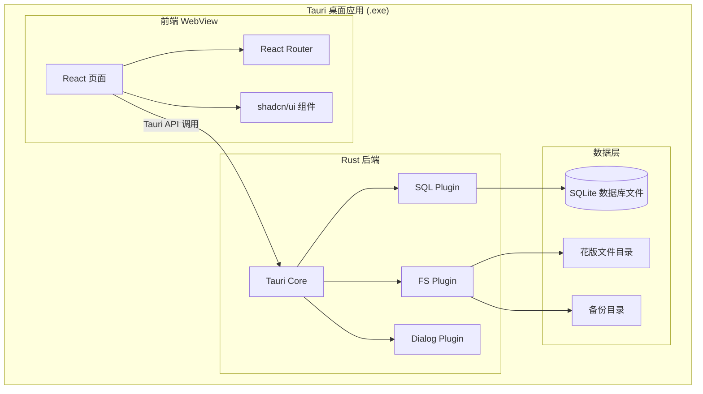
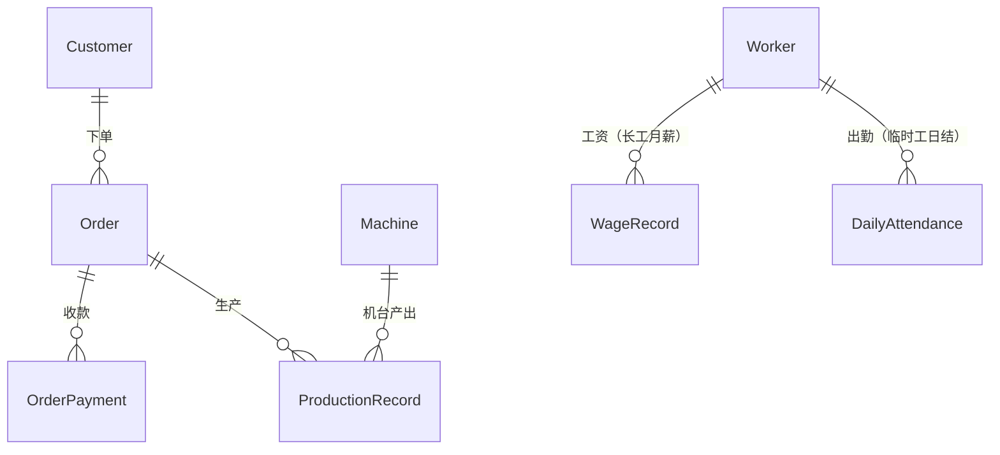
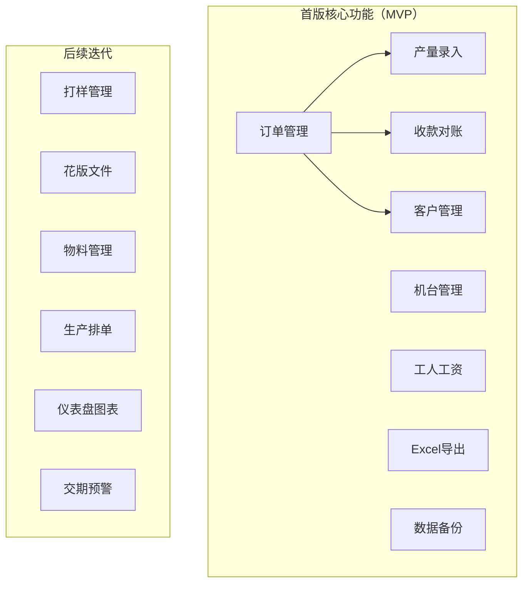
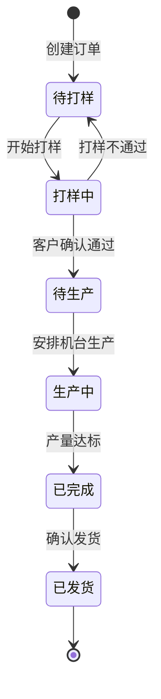
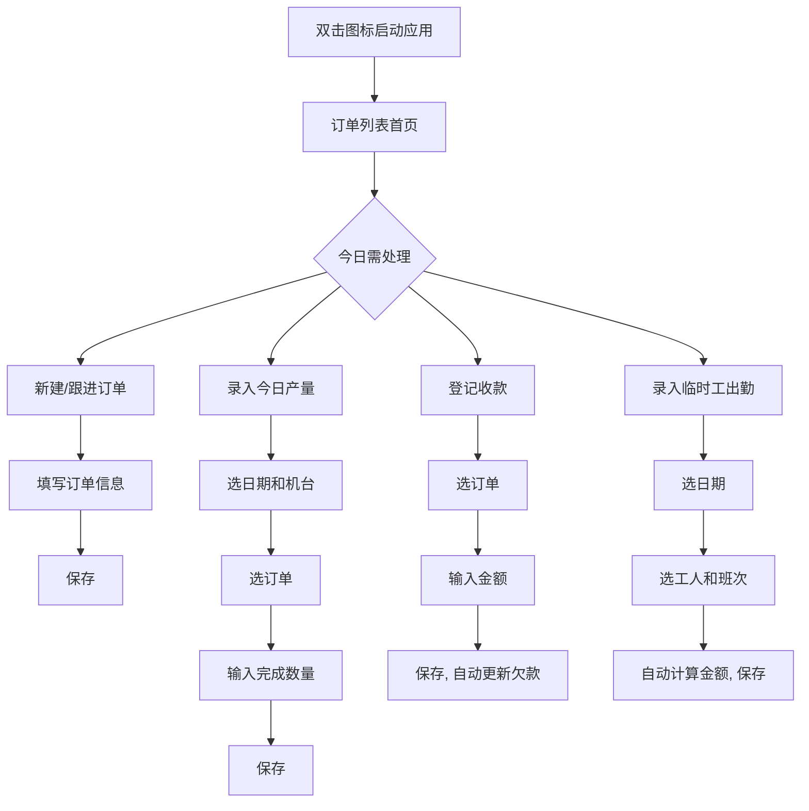
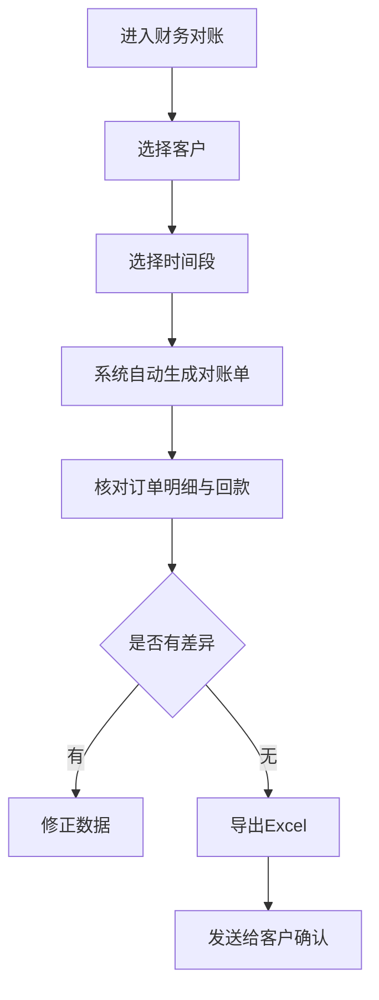

# 电脑绣花厂订单管理系统 -- 开发文档（桌面应用版）

## 一、项目概述

### 1.1 项目背景

电脑绣花（又称机绣）是纺织后加工行业的重要环节。小型绣花厂（4-8 台绣花机、2-3 名工人）普遍存在以下痛点：

- 订单信息手写记账，查询/统计困难
- 花版文件（DST/EMB）散落在 U 盘和电脑中，经常找不到
- 与客户对账靠"翻本子"，效率低、易出差异
- 物料（绣花线、衬纸、绣花针）领用无记录，浪费难追溯
- 产量统计靠手算，每月汇总费时费力

本系统目标是用一套**轻量级桌面应用**替代手工记账，做到"双击打开、录入简单、查询方便、自动算账"。

### 1.2 用户与使用模式

**唯一操作者：厂长/老板**，在车间或办公室的一台 Windows 电脑上使用。工人不直接操作系统，所有数据（产量、领料等）由厂长统一录入。

这意味着：

- 不需要多用户登录系统，不需要手机端
- 不需要用户角色和权限区分
- 不需要局域网/互联网访问
- 界面只需适配 PC 桌面即可
- 可设置一个简单的启动密码防止他人随意查看

### 1.3 工资模式

工人分为两类，薪资结算方式不同：

- **长工（固定工）**: 固定月薪，按月发放，没有计件提成
- **临时工（日结工）**: 按天结算，区分白班和夜班两种单价。例如白班 200 元/天，夜班 250 元/天。厂长记录每位临时工每天上的是白班还是夜班，系统自动汇总应付金额

### 1.4 行业术语速查

- **花版/花样**: 绣花的图案设计文件
- **DST**: 田岛三进制格式，绣花机可直接读取的文件格式
- **EMB**: 田岛设计源文件格式，用于编辑修改（修改花版应使用此格式）
- **版号**: 花版的唯一编号，用于快速匹配生产
- **针数**: 绣花图案的总针数，直接决定生产时间和成本
- **打样**: 正式生产前的试绣样品，供客户确认
- **锁头**: 隔头工作方式，用于花型循环大于机器头距的场景
- **衬纸/水溶衬**: 绣花底衬，生产必备辅料
- **色号**: 绣花线的颜色编号（如 Madeira/Isacord 色卡号）

---

## 二、开发方法论 -- 驾驭工程 (Harness Engineering)

本项目采用**驾驭工程**方法论进行 AI 辅助开发。核心理念：**人类掌舵，智能体执行**。不依赖"换更强的模型"来保证质量，而是通过约束环境、反馈回路和活文档，让 AI 辅助开发过程稳定、可靠、不失控。

> "Agent 的每一次失败，都是环境设计不完善的信号。正确的回应不是换一个更强的模型，而是重新设计它运行的环境。" -- Mitchell Hashimoto

### 2.1 四根护栏在本项目中的落地

#### 护栏一：上下文工程 -- 活文档体系

创建 `.cursor/rules/` 规则文件，作为 AI 进入代码库的"工作手册"。规则文件不是静态文档，而是**活的反馈循环** -- 每当 AI 犯错，就把教训写入规则文件，确保同类错误不再发生。

```
.cursor/rules/
├── project.md            # 项目概述、业务背景、行业术语表
├── architecture.md       # 分层架构、模块边界、依赖方向
├── coding-standards.md   # 命名规范、文件组织、组件编写模式
├── database.md           # 表设计约定、Drizzle 使用规范、查询模式
├── ui-patterns.md        # shadcn/ui 使用约定、布局规范、交互模式
└── troubleshooting.md    # 已知坑和解决方案（持续积累）
```

同时在项目根目录放置 `AGENTS.md`，作为 AI 进入项目的"第一眼"入口，指向各规则文件。

#### 护栏二：架构约束 -- 自动化缰绳

约束必须自动化执行，不依赖人工 Review：

- **TypeScript strict mode**: `strict: true`，零 `any` 容忍，所有函数必须有返回类型
- **ESLint**: 禁止 console.log、禁止未使用变量、强制 import 排序
- **Prettier**: 统一代码格式，消除风格争论
- **分层依赖规则**: 明确的调用方向，违反即编译/lint 报错

```
分层依赖模型（下层不可反向依赖上层）:

  types/        # 纯类型定义，零依赖
    ↓
  lib/schema    # Drizzle 表定义，仅依赖 types
    ↓
  lib/queries   # 数据库查询函数，依赖 schema
    ↓
  hooks/        # React hooks，封装 queries
    ↓
  components/   # UI 组件，使用 hooks
    ↓
  pages/        # 页面组件，组合 components
```

#### 护栏三：反馈循环 -- 自动验证

每次代码变更都必须通过以下自动检查链：

```
代码变更 -> TypeScript 编译检查 -> ESLint 检查 -> Prettier 格式检查 -> Vitest 单元测试 -> 通过/失败
                                                                                          ↓
                                                                              失败信息回传给 AI 自动修复
```

重点测试覆盖的业务逻辑：

- 订单金额计算（总金额 = 数量 x 单价，未收 = 总金额 - 已付）
- 订单状态流转合法性检查
- 库存扣减和预警阈值判断
- 对账单金额汇总

#### 护栏四：熵管理 -- 持续清理

- **Phase 回顾机制**: 每完成一个 Phase，执行全量 lint + type-check + test，将新发现的问题回写规则文件
- **文档同步**: 规则文件随代码演进持续更新，过时的规则及时删除
- **技术债标记**: 对临时方案用 `// TODO(debt):` 标记，在 Phase 回顾时集中处理
- **代码清理**: 每个 Phase 回顾时检查未使用的 import、冗余代码、过期注释

### 2.2 驾驭工程带来的预期收益

- AI 重复犯相同错误的概率大幅降低（教训被固化到规则文件中）
- 架构一致性有自动化保障（不依赖人记住规范）
- 每个 Phase 交付的代码质量可控、可验证
- 技术债务不会静默积累（定期清理 + 标记追踪）

---

## 三、技术栈选型

### 3.1 选型原则

- **桌面原生体验**: 双击 `.exe` 即可启动，像普通软件一样使用，无需理解浏览器/URL/服务器
- **零基础设施**: 内嵌 SQLite 数据库，无需安装任何数据库软件
- **轻量极速**: 安装包 < 15MB，内存占用 < 100MB，启动 < 1 秒
- **开发效率高**: 前端使用 React + TypeScript，UI 生态成熟
- **长期可维护**: Tauri 由 Rust 驱动，性能和安全性优秀

### 3.2 技术栈

```
桌面框架:    Tauri 2.0 (Rust 后端 + WebView 前端)
前端框架:    React 19 + TypeScript
路由:        React Router 7
UI 组件库:   shadcn/ui + Tailwind CSS 4
数据库:      SQLite (通过 tauri-plugin-sql 内嵌)
ORM:         Drizzle ORM (类型安全，轻量)
图表:        Recharts
文件操作:    tauri-plugin-fs + tauri-plugin-dialog
导出:        xlsx (Excel 导出)
打包分发:    Tauri bundler (生成 .msi / .exe 安装包)
```

### 3.3 为什么选择 Tauri 2 而不是 Electron 或 Web


| 对比维度  | Tauri 2   | Electron     | Web (浏览器)      |
| ----- | --------- | ------------ | -------------- |
| 安装包大小 | 5-15 MB   | 150-200 MB   | 不需要安装，但需启动服务   |
| 内存占用  | 50-100 MB | 300-500 MB   | 取决于浏览器         |
| 启动速度  | < 1 秒     | 2-3 秒        | 需先启动服务 + 打开浏览器 |
| 用户体验  | 双击打开，原生窗口 | 双击打开，原生窗口    | 需要懂 URL、命令行    |
| 文件操作  | 原生文件对话框   | 原生文件对话框      | 受浏览器沙箱限制       |
| 安全性   | Rust 级安全  | Node.js 安全模型 | 浏览器沙箱          |


**结论**: Tauri 2 在轻量性、启动速度和用户体验上完胜，特别适合"单机使用、双击启动"的小型工厂场景。

### 3.4 架构图




---

## 四、数据库设计

### 4.1 核心实体关系

核心表（首版实现）用实线，次要表（后续迭代）用虚线标注。




### 4.2 核心数据表（首版实现）

**Customer (客户)**

- id, name, contactPerson, phone, address, settlementType (现结/月结/批结), invoiceInfo, notes, createdAt

**Order (订单)**

- id, orderNo (唯一), customerId, orderDate, deliveryDate, productName, patternName, patternNo, fabricType, embPosition, embSize, colorCount, stitchCount, quantity, unitPrice, totalAmount, deposit, unpaidAmount, status (待打样/打样中/待生产/生产中/已完成/已发货), specialNotes, createdAt, updatedAt

**Machine (机台)**

- id, name, model, headCount, status (正常/维修/停机), notes

**Worker (工人)**

- id, name, type (长工/临时工), monthlySalary (长工月薪，临时工为空), dayRate (临时工白班单价), nightRate (临时工夜班单价), joinDate, status (在职/离职), phone, notes, createdAt

**ProductionRecord (生产记录)**

- id, orderId, machineId, date, stitchCount, quantity, defectCount, notes, createdAt

**OrderPayment (收款记录)**

- id, orderId, amount, paymentDate, paymentMethod (现金/转账/其他), notes, createdAt

**WageRecord (长工工资发放记录)**

- id, workerId, month (如 "2026-04"), salary, isPaid, paidDate, notes, createdAt

**DailyAttendance (临时工出勤记录)**

- id, workerId, date, shift (白班/夜班), amount (当日应付金额，自动根据 dayRate/nightRate 计算), isPaid, paidDate, notes, createdAt

**AppConfig (系统配置)**

- id, key, value (存储启动密码、备份路径、上次备份时间等)

### 4.3 次要数据表（后续迭代添加）

**Sample (打样)** -- 关联订单，记录打样次数/结果/客户确认状态

**DesignFile (花版文件)** -- 关联订单和版号，存储文件路径

**Material (物料)** -- 物料名称、类型、色号、库存、最低库存

**MaterialUsage (物料领用)** -- 关联物料和订单的领用记录

**ProductionSchedule (生产排单)** -- 机台任务分配和时间安排

---

## 五、功能模块设计

### 5.1 功能分级



### 5.2 首版核心模块详细设计

#### M1: 订单管理（核心中的核心）

- **订单列表**: 表格展示，按状态筛选/关键词搜索/日期排序，彩色状态标签
- **新建/编辑订单**: 表单，客户下拉选择（支持内联新建客户），必填字段标记，自动计算总金额 = 数量 x 单价，未收金额 = 总金额 - 已收定金
- **订单详情**: Tab 页：基本信息 / 生产记录 / 收款记录
- **状态快速切换**: 下拉菜单一键切换订单状态（待打样/打样中/待生产/生产中/已完成/已发货）

#### M2: 客户管理

- **客户列表**: 搜索、查看基本信息
- **客户详情**: 历史订单列表、回款情况汇总
- **快速新建**: 在新建订单时可直接内联创建新客户

#### M3: 生产管理（简化版）

- **机台管理**: 添加/编辑机台（名称、型号、机头数）
- **产量录入**: 选日期 -> 选机台 -> 选订单 -> 输入完成数量/针数/次品数，保存

#### M4: 收款与对账

- **收款登记**: 关联订单，录入收款金额/方式/日期，自动更新订单未收金额
- **客户对账单**: 选择客户 + 时间段，自动生成对账单（含订单明细、收款明细、欠款汇总）
- **Excel 导出**: 对账单、订单列表一键导出为 `.xlsx` 文件

#### M5: 工人与工资管理

- **工人列表**: 姓名、类型（长工/临时工）、薪资信息、状态
- **长工工资**:
  - 显示每位长工的固定月薪
  - 按月生成工资条，标记是否已发放，记录发放日期
  - 查看历史发放记录
- **临时工出勤与日结**:
  - 记录临时工每天出勤：选日期 -> 选工人 -> 选班次（白班/夜班）
  - 自动根据工人设定的白班/夜班单价计算当日应付金额
  - 支持批量录入（一次录入多人同一天的出勤）
  - 按时间段汇总应付金额，标记是否已结清
  - 导出临时工工资明细为 Excel
- **工资汇总**: 按月查看全部工人（长工 + 临时工）的工资总支出

#### M6: 系统设置与备份

- **启动密码**: 可选，设置/修改/清除
- **数据备份**: 一键导出数据库文件为备份
- **数据恢复**: 选择备份文件恢复
- **备份提醒**: 超过 7 天未备份时启动弹窗提醒

### 5.3 后续迭代功能（首版不实现）

- **打样管理**: 打样次数/结果/客户确认，关联订单
- **花版文件管理**: 上传 DST/EMB 文件，关联订单和版号
- **物料管理**: 绣花线/衬纸/绣花针库存 + 领料登记 + 库存预警
- **生产排单**: 为订单分配机台和生产时间段
- **首页仪表盘**: 待办概览、关键指标卡片、图表
- **交期预警**: 临近交货日期的订单提醒
- **营收统计**: 月度营收图表、客户回款排行

---

## 六、页面路由与窗口布局

### 6.1 路由结构（React Router）

首版核心路由：

```
/                         -> 订单列表（应用首页，最常用）
/orders/new               -> 新建订单
/orders/:id               -> 订单详情 (含生产记录/收款记录 Tab)
/orders/:id/edit          -> 编辑订单
/production               -> 产量录入
/finance                  -> 收款与对账
/finance/statement        -> 生成对账单
/customers                -> 客户列表
/customers/:id            -> 客户详情
/workers                  -> 工人与工资管理
/workers/attendance       -> 临时工出勤录入
/settings                 -> 系统设置（机台管理 + 启动密码 + 备份恢复）
```

后续迭代新增路由：

```
/dashboard                -> 仪表盘（替代订单列表作为首页）
/samples                  -> 打样管理
/designs                  -> 花版文件管理
/materials                -> 物料管理
/production/schedule      -> 生产排单
```

### 6.2 窗口布局

- **固定左侧导航栏**: 宽度 220px，包含所有模块入口，每项带图标 + 中文标签，当前页面高亮
- **右侧内容区**: 顶部面包屑导航 + 操作按钮区，下方为页面主体内容
- **启动密码弹窗**: 应用启动时，如果设置了密码则弹出输入框（简单数字密码即可）
- **设计风格**: 浅色主题，大字号（正文 16px），充足留白，操作按钮突出醒目
- **窗口尺寸**: 默认 1280x800，最小 1024x700，支持最大化

---

## 七、项目目录结构

```
xiuhua/
├── AGENTS.md                     # 驾驭工程入口文档
├── .cursor/rules/                # AI 规则文件（驾驭工程护栏一）
│   ├── project.md
│   ├── architecture.md
│   ├── coding-standards.md
│   ├── database.md
│   ├── ui-patterns.md
│   └── troubleshooting.md
├── src-tauri/                    # Tauri Rust 后端
│   ├── src/
│   │   ├── lib.rs                # 插件注册、迁移定义
│   │   └── main.rs               # 应用入口
│   ├── capabilities/
│   │   └── default.json          # 权限声明 (sql, fs, dialog)
│   ├── icons/                    # 应用图标
│   ├── Cargo.toml
│   └── tauri.conf.json           # Tauri 配置 (窗口、打包)
├── src/                          # React 前端
│   ├── main.tsx                  # 应用入口
│   ├── App.tsx                   # 根组件 + Router
│   ├── pages/
│   │   ├── Dashboard.tsx         # 首页仪表盘
│   │   ├── orders/
│   │   │   ├── OrderList.tsx
│   │   │   ├── OrderForm.tsx
│   │   │   └── OrderDetail.tsx
│   │   ├── production/
│   │   │   └── ProductionRecord.tsx
│   │   ├── finance/
│   │   │   ├── Finance.tsx
│   │   │   └── Statement.tsx
│   │   ├── customers/
│   │   │   ├── CustomerList.tsx
│   │   │   └── CustomerDetail.tsx
│   │   ├── workers/
│   │   │   ├── WorkerList.tsx
│   │   │   └── Attendance.tsx    # 临时工出勤录入
│   │   └── Settings.tsx
│   ├── components/
│   │   ├── ui/                   # shadcn/ui 组件
│   │   ├── layout/
│   │   │   ├── Sidebar.tsx       # 左侧导航栏
│   │   │   ├── MainLayout.tsx    # 主布局
│   │   │   └── Breadcrumb.tsx
│   │   └── shared/               # StatusBadge, SearchBar, ExportBtn 等
│   ├── lib/
│   │   ├── db.ts                 # SQLite 连接 + Drizzle 客户端
│   │   ├── schema.ts             # Drizzle 表定义
│   │   ├── queries/              # 按模块的数据库查询函数
│   │   │   ├── orders.ts
│   │   │   ├── production.ts
│   │   │   ├── finance.ts
│   │   │   ├── workers.ts
│   │   │   └── customers.ts
│   │   ├── export.ts             # Excel 导出工具
│   │   └── utils.ts              # 通用工具函数 (日期格式化、金额计算等)
│   ├── hooks/                    # 自定义 React hooks
│   ├── types/                    # TypeScript 类型定义
│   └── styles/
│       └── globals.css           # Tailwind 全局样式
├── __tests__/                    # Vitest 单元测试（驾驭工程护栏三）
│   ├── orders.test.ts
│   ├── finance.test.ts
│   └── wages.test.ts
├── index.html
├── package.json
├── vite.config.ts                # Vite 构建配置
├── vitest.config.ts              # Vitest 测试配置
├── tailwind.config.ts
├── tsconfig.json
├── eslint.config.js              # ESLint 配置（驾驭工程护栏二）
├── .prettierrc                   # Prettier 配置
└── drizzle.config.ts             # Drizzle 迁移配置
```

---

## 八、关键交互流程

### 8.1 订单全生命周期




### 8.2 厂长日常操作流程




### 8.3 月末对账流程




---

## 九、非功能性需求

### 9.1 性能

- 应用启动 < 1 秒
- 列表页渲染 < 500ms（SQLite 本地查询，零网络延迟）
- 支持 10,000+ 订单历史数据无卡顿
- 安装包 < 15MB

### 9.2 易用性

- 双击桌面图标即可使用，无需任何技术知识
- 所有核心操作不超过 3 步点击
- 中文界面，零英文术语
- 表单支持 Tab 键快速切换字段
- 常用操作有键盘快捷键（如 Ctrl+N 新建订单）

### 9.3 数据安全

- 可选启动密码，防止他人查看经营数据
- 一键备份为 `.zip` 文件（含数据库 + 花版文件）
- 一键从备份文件恢复
- 超过 7 天未备份时弹窗提醒
- 数据全部存储在本机，不联网，不上传

### 9.4 部署与分发

- 生成 Windows `.msi` 安装包，双击安装
- 也可生成免安装的 `.exe` 便携版
- 支持 Windows 10/11
- 数据存储在用户 AppData 目录下，卸载不丢失数据

---

## 十、分阶段实施计划（精简为 3+1 阶段，快速交付 MVP）

### Phase 0: 驾驭工程基座（在写任何业务代码之前）

先造"高速公路和护栏"，再让 AI 跑起来。

- 创建 `AGENTS.md` + `.cursor/rules/` 规则文件体系
- 配置 TypeScript strict + ESLint + Prettier
- 配置 Vitest 测试框架 + 第一个冒烟测试

### Phase 1: 基础骨架

- Tauri 2 + React + Vite 项目初始化
- 集成 tauri-plugin-sql + Drizzle ORM + SQLite
- 集成 shadcn/ui + Tailwind CSS
- 数据库建表迁移（核心表：Customer, Order, Machine, Worker, ProductionRecord, OrderPayment, WageRecord, DailyAttendance, AppConfig）
- 主窗口布局（左侧导航 + 内容区）
- 可选启动密码
- **Phase 1 回顾**: 全量 lint + type-check，将问题回写规则文件

### Phase 2: 核心业务

- 订单 CRUD + 状态流转
- 客户管理（列表/新建/编辑/详情，订单内联新建）
- 机台管理（增删改查，放在设置页）
- 产量录入（选日期 -> 选机台 -> 选订单 -> 输数量）
- 核心业务单元测试（金额计算、状态流转）
- **Phase 2 回顾**: 全量检查，更新规则文件

### Phase 3: 钱相关 + MVP 完成

- 收款登记（自动更新订单未收金额）
- 客户对账单生成（按客户 + 时间段）
- 工人管理（长工 + 临时工，设置薪资参数）
- 长工月度工资记录 + 发放标记
- 临时工出勤录入（选日期 -> 选工人 -> 选班次，自动算金额）
- 临时工工资汇总 + 结算标记
- Excel 导出（对账单、订单列表、工资明细）
- 数据备份/恢复 + 备份提醒
- 全量测试（收款金额、工资计算）
- **Phase 3 回顾 + MVP 发布**: 全量检查，打包 `.msi` 安装包

---

### 后续迭代（MVP 交付后按需添加）

优先级从高到低：

1. **打样管理 + 花版文件管理** -- 解决花版文件散乱的痛点
2. **物料管理 + 库存预警** -- 解决物料浪费/短缺问题
3. **仪表盘 + 营收图表** -- 经营数据可视化
4. **交期预警** -- 订单临期自动提醒
5. **生产排单** -- 机台任务分配与调度

